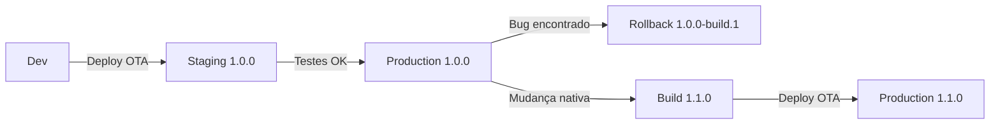

# 🔥 Hot Updater - Guia Completo

**Versão do Hot Updater:** 0.25.7  
**Última atualização:** 22/01/2026

Sistema de atualizações OTA (Over-The-Air) para React Native, permitindo atualizar o app sem precisar publicar nova versão na App Store/Play Store.

---

## 📋 Índice

1. [O que é o Hot Updater?](#o-que-é-o-hot-updater)
2. [Configuração Inicial](#configuração-inicial)
3. [Conceitos Fundamentais](#conceitos-fundamentais)
4. [Gerenciamento de Versões](#gerenciamento-de-versões)
5. [Deploy de Atualizações](#deploy-de-atualizações)
6. [Rollback](#rollback)
7. [Monitoramento](#monitoramento)
8. [Boas Práticas](#boas-práticas)
9. [Troubleshooting](#troubleshooting)

---

## 🎯 O que é o Hot Updater?

O Hot Updater é uma solução de **OTA (Over-The-Air) Updates** que permite:

- ✅ Atualizar JavaScript, assets e estilos sem nova build nativa
- ✅ Correções de bugs instantâneas
- ✅ Implantação gradual de features
- ✅ Rollback rápido em caso de problemas
- ✅ Múltiplos canais de distribuição (production, staging, beta)

### ⚠️ Limitações

❌ **Não permite atualizar:**

- Código nativo (Java/Kotlin/Swift/Objective-C)
- Dependências nativas
- Configurações do Info.plist ou AndroidManifest.xml
- Versão do app (necessita build nativa)

---

## ⚙️ Configuração Inicial

### 1. Estrutura de Arquivos

```
ecommerce-app/
├── hot-updater.config.ts      # Configuração do Hot Updater
├── .env.hotupdater            # Variáveis de ambiente
├── firebase-adminsdk-credentials.json  # Credenciais Firebase
├── babel.config.js            # IMPORTANTE: ordem dos plugins
└── App.tsx                    # Componente wrapper
```

### 2. Babel Configuration

**⚠️ CRÍTICO:** A ordem dos plugins é essencial!

```js
// babel.config.js
module.exports = function (api) {
  api.cache(true);
  return {
    presets: ['babel-preset-expo'],
    plugins: [
      ['hot-updater/babel-plugin'], // ✅ Primeiro
      'react-native-worklets/plugin', // ✅ Último
    ],
  };
};
```

### 3. Configuração do Hot Updater

```ts
// hot-updater.config.ts
import { expo } from '@hot-updater/expo';
import { firebaseDatabase, firebaseStorage } from '@hot-updater/firebase';
import * as admin from 'firebase-admin';
import { defineConfig } from 'hot-updater';

const credential = admin.credential.applicationDefault();

export default defineConfig({
  build: expo(),
  storage: firebaseStorage({
    projectId: process.env.HOT_UPDATER_FIREBASE_PROJECT_ID,
    storageBucket: process.env.HOT_UPDATER_FIREBASE_STORAGE_BUCKET,
    credential,
  }),
  database: firebaseDatabase({
    projectId: process.env.HOT_UPDATER_FIREBASE_PROJECT_ID,
    credential,
  }),
  updateStrategy: 'appVersion', // ou "fingerprint"
});
```

### 4. Variáveis de Ambiente

```bash
# .env.hotupdater
HOT_UPDATER_FIREBASE_PROJECT_ID=seu-projeto-id
HOT_UPDATER_FIREBASE_STORAGE_BUCKET=seu-bucket.appspot.com
GOOGLE_APPLICATION_CREDENTIALS=./firebase-adminsdk-credentials.json
```

### 5. Integração no App

```tsx
// App.tsx
import { HotUpdater } from '@hot-updater/react-native';
import { UpdateScreen } from '@design-system/components/UpdateScreen';

function App() {
  return (
    // Seu app aqui
  );
}

export default HotUpdater.wrap({
  baseURL: "https://hot-updater-xxx.run.app/api/check-update",
  updateStrategy: "appVersion",
  updateMode: "auto",
  fallbackComponent: ({ progress, status }) => (
    <UpdateScreen progress={progress} status={status} />
  ),
  onError: (error) => {
    console.error('Hot Updater Error:', error);
  },
})(App);
```

---

## 📚 Conceitos Fundamentais

### App Version vs Bundle Version

```
App (nativa)
├── App Version: 1.0.0 (Info.plist / build.gradle)
│   └── Bundle Version: 1.0.0-build.1 (Hot Updater)
│   └── Bundle Version: 1.0.0-build.2 (Hot Updater)
│   └── Bundle Version: 1.0.0-build.3 (Hot Updater)
├── App Version: 1.1.0 (Info.plist / build.gradle)
│   └── Bundle Version: 1.1.0-build.1 (Hot Updater)
│   └── Bundle Version: 1.1.0-build.2 (Hot Updater)
```

- **App Version (Native)**: Define em `app.json` → `version`
- **Bundle Version (OTA)**: Gerado automaticamente pelo Hot Updater

### Estratégias de Atualização

#### 1. `appVersion` (Recomendado)

```ts
updateStrategy: 'appVersion';
```

- ✅ Mais simples e previsível
- ✅ Sincronizado com a versão da App Store
- ✅ Ideal para gerenciamento por versão
- Atualiza apenas apps com a mesma `version` do app.json

#### 2. `fingerprint` (Avançado)

```ts
updateStrategy: 'fingerprint';
```

- ✅ Atualiza baseado no hash das dependências nativas
- ✅ Mais flexível para múltiplas versões
- ⚠️ Requer mais cuidado no gerenciamento

### Modos de Atualização

```tsx
updateMode: 'auto' | 'manual';
```

- **auto**: Baixa e instala automaticamente
- **manual**: Requer intervenção do usuário

---

## 🔢 Gerenciamento de Versões

### Estrutura de Versão Semântica

```
MAJOR.MINOR.PATCH
  1  .  0  .  0
  │    │    └── Correções de bugs
  │    └─────── Novas features (compatível)
  └──────────── Breaking changes (incompatível)
```

### Quando Incrementar Versões

| Mudança                 | Versão        | Tipo de Deploy  |
| ----------------------- | ------------- | --------------- |
| Correção de bug JS      | 1.0.0 → 1.0.0 | ✅ OTA          |
| Nova feature JS         | 1.0.0 → 1.0.0 | ✅ OTA          |
| Ajuste de estilo        | 1.0.0 → 1.0.0 | ✅ OTA          |
| Nova dependência nativa | 1.0.0 → 1.1.0 | ❌ Native Build |
| Breaking change         | 1.0.0 → 2.0.0 | ❌ Native Build |

### Fluxo de Versionamento



---

## 🚀 Deploy de Atualizações

### 1. Preparação

```bash
# 1. Verificar status do projeto
npx expo-doctor

# 2. Limpar cache
rm -rf .expo node_modules/.cache

# 3. Verificar versão do Node.js (>=20.19.4)
node --version

# 4. Verificar babel.config.js
# Garantir que hot-updater/babel-plugin vem ANTES de worklets
```

### 2. Deploy Interativo

```bash
# Deploy com seleção interativa
yarn hot-updater deploy -i

# Opções:
# - Escolher plataforma: iOS / Android / Both
# - Escolher canal: production / staging / beta
# - Escolher versão do app alvo
```

### 3. Deploy Direto

```bash
# iOS - Production
yarn hot-updater deploy --platform ios --channel production --app-version 1.0.0

# Android - Staging
yarn hot-updater deploy --platform android --channel staging --app-version 1.0.0

# Ambas plataformas
yarn hot-updater deploy --platform both --channel production --app-version 1.0.0
```

### 4. Force Update (Obrigatório)

```bash
# Força todos usuários a atualizarem imediatamente
yarn hot-updater deploy -i --force-update

# ⚠️ Use com cautela! Usuários não poderão usar o app sem atualizar
```

### 5. Rollout Gradual

```bash
# Deploy para 10% dos usuários
yarn hot-updater deploy -i --rollout-percentage 10

# Aumentar gradualmente
yarn hot-updater deploy -i --rollout-percentage 50
yarn hot-updater deploy -i --rollout-percentage 100
```

### 6. Mensagens Customizadas

```bash
# Adicionar mensagem de atualização
yarn hot-updater deploy -i --message "Nova feature: Carrinho melhorado!"
```

---

## ⏪ Rollback

### Quando fazer Rollback?

- ❌ Bug crítico detectado em produção
- ❌ Crash reports aumentando
- ❌ Performance degradada
- ❌ Feature não funcionando como esperado

### Como fazer Rollback

#### 1. Listar Bundles Disponíveis

```bash
# Ver histórico de deploys
yarn hot-updater list --channel production --platform ios
```

Output:

```
┌─────────┬────────────────┬─────────┬──────────────┬────────┐
│ Version │ Bundle ID      │ Channel │ Platform     │ Status │
├─────────┼────────────────┼─────────┼──────────────┼────────┤
│ 1.0.0   │ 1.0.0-build.3  │ prod    │ ios          │ active │
│ 1.0.0   │ 1.0.0-build.2  │ prod    │ ios          │ -      │
│ 1.0.0   │ 1.0.0-build.1  │ prod    │ ios          │ -      │
└─────────┴────────────────┴─────────┴──────────────┴────────┘
```

#### 2. Executar Rollback

```bash
# Voltar para o bundle anterior
yarn hot-updater rollback --channel production --platform ios --bundle-id 1.0.0-build.2

# Rollback com força (obrigatório)
yarn hot-updater rollback --channel production --platform ios --bundle-id 1.0.0-build.1 --force-update
```

#### 3. Verificar Rollback

```bash
# Confirmar que o bundle correto está ativo
yarn hot-updater list --channel production --platform ios
```

### Estratégia de Rollback Rápido

```bash
#!/bin/bash
# rollback-emergency.sh

echo "🚨 Iniciando rollback de emergência..."

# iOS
yarn hot-updater rollback --channel production --platform ios --bundle-id ${LAST_GOOD_BUNDLE} --force-update

# Android
yarn hot-updater rollback --channel production --platform android --bundle-id ${LAST_GOOD_BUNDLE} --force-update

echo "✅ Rollback concluído!"
```

---

## 📊 Monitoramento

### 1. Logs do App

```tsx
// App.tsx
export default HotUpdater.wrap({
  // ...
  onUpdateAvailable: (update) => {
    console.log('📦 Nova atualização disponível:', update);
    // Enviar para analytics
    analytics.logEvent('hot_update_available', {
      version: update.version,
      bundleId: update.bundleId,
    });
  },
  onUpdateDownloading: (progress) => {
    console.log('⬇️ Download:', Math.round(progress * 100) + '%');
  },
  onUpdateDownloaded: () => {
    console.log('✅ Download concluído');
    analytics.logEvent('hot_update_downloaded');
  },
  onError: (error) => {
    console.error('❌ Erro:', error);
    // Enviar para Sentry/Crashlytics
    Sentry.captureException(error);
  },
})(App);
```

### 2. Dashboard do Firebase

Acesse: `https://console.firebase.google.com`

**Métricas importantes:**

- Storage: Uso de armazenamento dos bundles
- Database: Registros de updates por versão/canal
- Functions: Logs de check-update API

### 3. Métricas Recomendadas

```tsx
// Analytics de atualização
const trackUpdate = {
  // Taxa de adoção
  adoptionRate: (usersUpdated / totalUsers) * 100,

  // Tempo médio de download
  avgDownloadTime: totalDownloadTime / numberOfDownloads,

  // Taxa de sucesso
  successRate: (successfulUpdates / totalUpdateAttempts) * 100,

  // Taxa de erro
  errorRate: (failedUpdates / totalUpdateAttempts) * 100,
};
```

### 4. Alertas Recomendados

Configure alertas para:

- ⚠️ Taxa de erro > 5%
- ⚠️ Taxa de adoção < 70% após 24h
- ⚠️ Crash rate aumentou > 50%
- ⚠️ Tempo de download > 30s

---

## 🎯 Boas Práticas

### ✅ DO's

1. **Teste antes de deploy**

   ```bash
   # Build local para testar
   npx expo start --clear
   ```

2. **Use canais para staging**

   ```bash
   # Testar em staging primeiro
   yarn hot-updater deploy --channel staging
   ```

3. **Mantenha histórico de bundles**

   ```bash
   # Nunca delete bundles antigos imediatamente
   # Mantenha pelo menos 3 versões anteriores
   ```

4. **Documente cada deploy**

   ```bash
   # Adicione mensagens descritivas
   yarn hot-updater deploy -i --message "Fix: Carrinho duplicando itens"
   ```

5. **Monitore após deploy**

   ```bash
   # Acompanhe logs por 1-2 horas após deploy
   # Esteja pronto para rollback
   ```

6. **Rollout gradual para mudanças grandes**
   ```bash
   # Começe com 10%, depois 50%, depois 100%
   yarn hot-updater deploy -i --rollout-percentage 10
   ```

### ❌ DON'Ts

1. ❌ **Nunca faça deploy direto em produção sem testar**
2. ❌ **Não use --force-update sem necessidade real**
3. ❌ **Não delete bundles antigos imediatamente**
4. ❌ **Não faça deploys em horários de pico**
5. ❌ **Não ignore erros no console do Hot Updater**
6. ❌ **Não tente atualizar código nativo via OTA**

### 📅 Checklist de Deploy

```markdown
- [ ] Testei localmente
- [ ] Executei npx expo-doctor
- [ ] Limpei cache (rm -rf .expo node_modules/.cache)
- [ ] Verifiquei babel.config.js
- [ ] Testei no simulador/emulador
- [ ] Deploy em staging primeiro
- [ ] Testei no staging
- [ ] Preparei mensagem de release
- [ ] Defini estratégia de rollout
- [ ] Preparei script de rollback
- [ ] Configurei monitoramento
- [ ] Deploy em produção
- [ ] Monitorei por 2h
```

---

## 🔧 Troubleshooting

### Problema: "babel-plugin not configured"

**Erro:**

```
Error: If you are using Babel, please check if 'hot-updater/babel-plugin'
is configured in babel.config.js
```

**Solução:**

```js
// babel.config.js
plugins: [
  ['hot-updater/babel-plugin'], // ✅ ANTES
  'react-native-worklets/plugin', // ✅ DEPOIS
];
```

### Problema: UpdateScreen em loop

**Causa:** Animações sendo reiniciadas constantemente

**Solução:** Componente já otimizado com `React.memo` e `useMemo`

### Problema: Bundle muito grande

**Sintoma:** Download demora muito

**Solução:**

```bash
# 1. Analisar bundle
npx expo export --platform ios --dump-sourcemap

# 2. Remover imports não usados
# 3. Usar code splitting
# 4. Otimizar assets
```

### Problema: Atualização não aparece

**Checklist:**

```bash
# 1. Verificar versão do app
# app.json version deve coincidir com --app-version

# 2. Verificar canal
# --channel deve coincidir com o configurado no app

# 3. Verificar plataforma
# iOS usa ios, Android usa android

# 4. Limpar cache do app
# iOS: Settings > General > iPhone Storage > App > Delete
# Android: Settings > Apps > App > Storage > Clear Cache
```

### Problema: Firebase authentication error

**Erro:**

```
Error: Could not load the default credentials
```

**Solução:**

```bash
# 1. Verificar .env.hotupdater
GOOGLE_APPLICATION_CREDENTIALS=./firebase-adminsdk-credentials.json

# 2. Verificar arquivo existe
ls -la firebase-adminsdk-credentials.json

# 3. Verificar permissões
chmod 600 firebase-adminsdk-credentials.json
```

### Problema: Node.js version incompatible

**Erro:**

```
TypeError: configs.toReversed is not a function
```

**Solução:**

```bash
# Usar Node.js 20+
nvm use 23.8.0  # ou a versão no .nvmrc
```

---

## 📖 Comandos Rápidos

```bash
# Deploy
yarn hot-updater deploy -i                          # Interativo
yarn hot-updater deploy -i --force-update           # Forçar atualização
yarn hot-updater deploy -i --rollout-percentage 50  # 50% dos usuários

# Listar
yarn hot-updater list                               # Todos os bundles
yarn hot-updater list --channel production          # Apenas production
yarn hot-updater list --platform ios                # Apenas iOS

# Rollback
yarn hot-updater rollback --bundle-id xxx           # Rollback interativo
yarn hot-updater rollback --bundle-id xxx --force-update  # Rollback forçado

# Limpar
yarn hot-updater clean --older-than 30d             # Limpar > 30 dias
yarn hot-updater clean --keep-last 5                # Manter últimos 5
```

---

## 🔗 Recursos Adicionais

- [Documentação Oficial](https://hot-updater.dev)
- [GitHub Repository](https://github.com/gronxb/hot-updater)
- [Discord Community](https://discord.gg/hot-updater)

---

## 📝 Changelog

- **v0.25.7** (22/01/2026): Versão atual
  - UpdateScreen independente do ThemeProvider
  - Suporte a rollout gradual
  - Melhorias no babel-plugin

---

**Última atualização:** 22/01/2026  
**Mantido por:** Equipe E-commerce App
